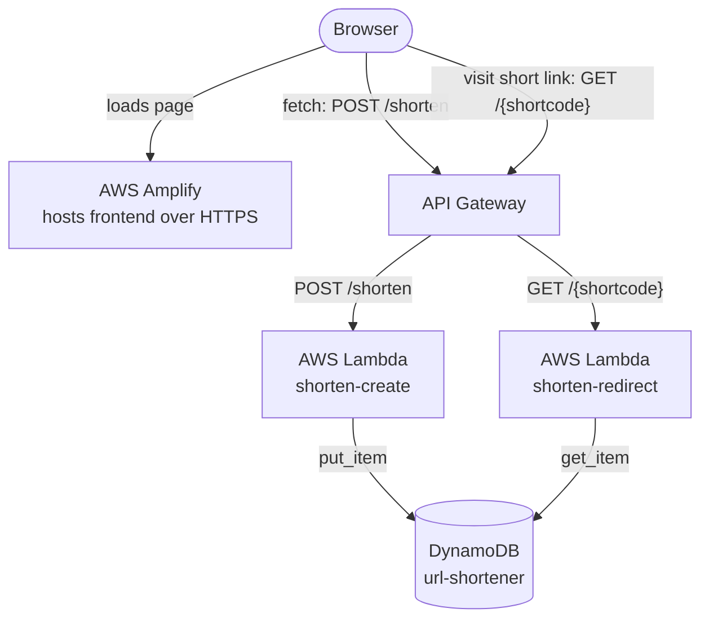

# 🌩️ Serverless URL Shortener

> Paste a long, messy link — get a short, shareable one back. Fully serverless, built end to end on AWS.

A URL shortener with no servers to manage. It scales to zero and costs effectively nothing at rest. This was one of my first hands-on AWS projects while moving into cloud engineering, and I built it to genuinely *understand* how serverless pieces fit together — not just to get something running.

---

## What it does

- **Create** — `POST /shorten` with `{ "url": "https://..." }` returns a short link and a 6-character code.
- **Redirect** — `GET /{shortcode}` looks up the code and returns a `301` redirect to the original URL.
- **Frontend** — a single-page UI where you paste a link, hit shorten, and watch the long URL compress into a short one.

---

## Architecture



The browser loads the page from Amplify once, then talks **directly** to API Gateway — both for creating links (a `fetch` from the page) and for visiting short links (a normal browser request). Amplify only serves the frontend; it isn't in the API request path.

---

## Tech stack

| Layer         | Service             | Why |
|---------------|---------------------|-----|
| Frontend host | AWS Amplify         | HTTPS out of the box, no manual certificate setup |
| API           | API Gateway (HTTP)  | Public front door; cheaper and simpler than REST API |
| Compute       | AWS Lambda (Python) | Runs only on request; scales to zero |
| Storage       | DynamoDB            | Pure key-value lookups (code -> URL) in milliseconds |
| Permissions   | IAM                 | Execution roles let each function reach the table |

---

## Why these choices

A URL shortener is a textbook key-value workload — hand it a code, it hands back a URL. There are no relationships or joins, so **DynamoDB** fits far better than a SQL database and costs nothing when idle. The work is also tiny and bursty: a function runs for a few milliseconds when someone creates or clicks a link, then nothing — exactly what **Lambda** is for, instead of paying for a server that sits idle. The theme across the whole stack is *scale to zero*: no traffic means no cost.

---

## Project structure

```
serverless-url-shortener/
├── create/
│   └── lambda_function.py     # POST /shorten   -> generate code, write to DynamoDB
├── redirect/
│   └── lambda_function.py     # GET /{shortcode} -> look up code, 301 redirect
├── frontend/
│   └── index.html             # single-page UI that calls the API
├── README.md
└── LICENSE
```

---

## How to deploy

1. **DynamoDB** — create a table `url-shortener` with partition key `shortcode` (String).
2. **Lambda** — create two functions from `create/` and `redirect/`. On each, set env var `TABLE_NAME=url-shortener` and attach DynamoDB permissions to the execution role.
3. **API Gateway (HTTP API)** — add routes `POST /shorten` -> `shorten-create` and `GET /{shortcode}` -> `shorten-redirect`.
4. **CORS** — on the API, allow origin `*`, methods `GET, POST, OPTIONS`, header `content-type`.
5. **Frontend** — set the `API` constant in `frontend/index.html` to your invoke URL, then host the file on AWS Amplify.

---

## Challenges & lessons

**A blank "Internal Server Error" with no detail.** A stray line of text had slipped into a function during a copy-paste, so Python couldn't even load the file. The takeaway: a *generic* 500 means the function crashed before its own error handling could run — a different problem from a 500 the code throws on purpose. Lambda's test traceback pointed straight to the offending line.

**CORS.** The frontend couldn't call the API until the API explicitly allowed cross-origin requests. Configuring CORS on API Gateway fixed it — and made clear *why* browsers block those calls by default.

---

## Possible improvements

- Use a `302` (temporary) redirect instead of `301` so analytics aren't lost to aggressive browser caching.
- Scope the IAM policy to this single table instead of full DynamoDB access.
- Add custom / vanity codes and collision handling on code generation.
- Track click counts per link.

---

<!--
OPTIONAL — add screenshots later for extra polish (not required; the README is complete without them).
To add one: edit this file on GitHub, drag an image into the editor, and GitHub uploads it for you.
Good ones to capture from your own account when you have a minute:
  - Your live frontend after shortening a link (the hero shot)
  - DynamoDB -> url-shortener -> Explore table items
  - API Gateway -> Routes (both routes with Lambda integrations)
-->

## Author

**Hillary Chukwuma** — backend developer moving into cloud engineering, working toward the AWS Solutions Architect Associate certification.
GitHub: [Hillary3000-web](https://github.com/Hillary3000-web)
